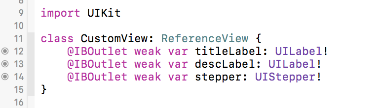
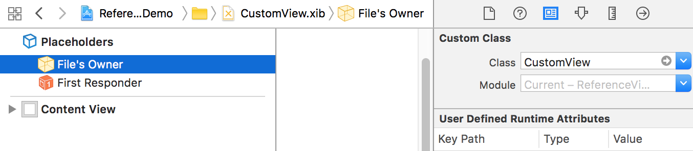
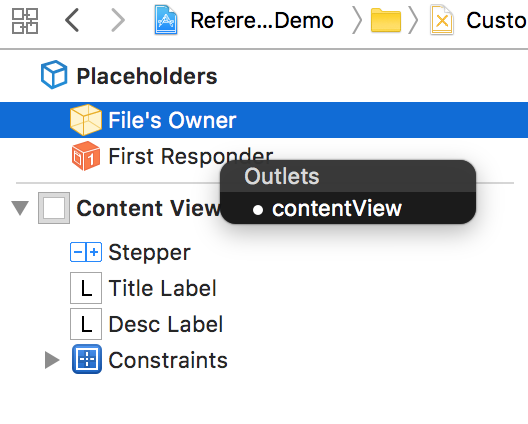
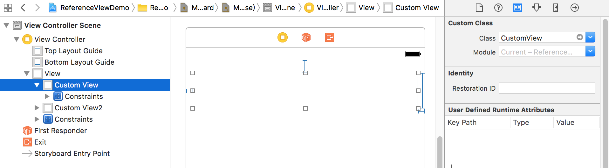

**0.** Create your custom view (include .swift & .xib file) with the same name.

**1.** Make your custom view extents form ReferenceView.

**2.** Set the **Custom class** of **File's Owner** to your custom view in xib file. 

**3.** Pin the ***contentView*** of **File's Owner** to your the top-level view in xib file.

**4.** Use your custom view in other storyboard or xib file(or code programmatically).

